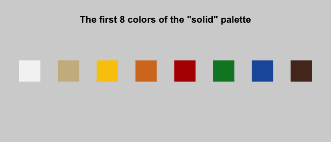
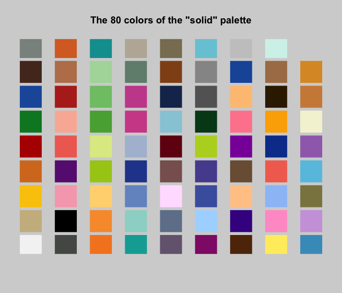

-   [lego](#lego)
    -   [Installation](#installation)
    -   [Setup](#setup)
    -   [Example 1](#example-1)
    -   [Example 2](#example-2)
    -   [Example 3](#example-3)
    -   [Example 4](#example-4)
    -   [Example 5](#example-5)
    -   [Colors](#colors)

<!-- README.md is generated from README.Rmd. Please edit that file -->
lego
====

The goal of lego is to make it possible for lego-lovers to prototype builds *in silico*.

Installation
------------

`lego` is not yet on CRAN, so for now you can download it from github with:

``` r
install.packages('devtools')
devtools::install_github(repo = 'rcorty/lego')
```

Setup
-----

To run any of the examples below, you'll need to start by loading `lego` and `dplyr`.

``` r
library(dplyr)
library(lego)
```

Example 1
---------

I want to stack a 2x2 brick on top of a 4x2 brick. It's easy!

``` r
new_build() %>% 
    lay_brick(width = 4, depth = 2) %>% 
    lay_brick_square(size = 2) ->
    build1

build1
```

You might say this build isn't much, but it's a valid build, as we can verify with:

``` r
check_build(build = build1)
```

Great -- let's have a look:

``` r
render_image(build = build1)
```

And now let's have a look in 3D 😍

``` r
render_3D(build = build1)
```

Example 2
---------

They way I made `build1` took advantage of a lot of "syntactic sugar", allowing the code to be very short. Now, let's make the same `build` more explicitly.

``` r
new_build(
    space = new_space(
        width = 10,
        height = 10,
        depth = 10
    ),
    blocks = new_blockset(
        name = 'classic_bucket'
    )
) %>% 
    lay_block(
        block = new_block(
            type = 'brick',
            width = 4, 
            depth = 2
        ),
        where = c(x = 0, y = 0)
    ) %>% 
    lay_block(
        block = new_block(
            type = 'brick',
            width = 2, 
            depth = 2
        ),
        where = c(x = 0, y = 0)
    ) ->
    build2

build2
```

That was a much longer way to build (what appears to be) the same thing. Let's confirm that they are actually the same.:

``` r
identical(build1, build2)
```

If we render an image and/or a 3D image of `build2`, it will be the same as `build1`. So let's move on to a more complex example.

Example 3
---------

Let's lay some more blocks of different types in different places.

Some examples that work.

\[do it here\]

Now some that generate warning messages.

\[do it here\]

See, we can change the options to not hassle us about builds that have various faults. Let's say I don't want to hear about using blocks that aren't in my blockset or placing blocks unsupported.

\[do it here\]

Now we can rerun that code that gave those warnings.

\[do it here\]

Great...no warnings. But, we didn't actually fix anything.

When we `check_build`, of course we get those warnings back.

\[do it here\]

So how can we really address them? Well, for a warning about using a block that's not in the blockset, we can just add to the blockset.

\[do it here\]

Remember, we're all digital at this point, so blocks are free. You may want to go on [Pick-A-Brick](https://shop.lego.com/en-US/Pick-a-Brick) or [bricklink](https://www.bricklink.com/v2/main.page) to figure out how to get the blocks you need for a price you can afford. `lego` will output a list of blocks you ended up using, which should be helpful.

To address the warning about unsupported `block`s, we can simply unlay the unsupported blocks and view the `build` again to see if we're happy without them.

\[do it here\]

If we're not happy without those `blocks` laid, we'll have to re-design.

\[do it here\]

Example 4
---------

Now I want to build a house. I can make a simple house with:

``` r
new_build() %>% 
    lay_tube(
        cross_section = lego_rectangle(
            width = 4,
            depth = 4
        ),
        extent = 4,
        where = c(x = 3, y = 3, z = 0)
    ) %>% 
    lay_panel(
        corner1 = c(x = 3, y = 3, z = 5),
        corner2 = c(x = 7, y = 5, z = 7)
    ) %>% 
    lay_panel(
        corner1 = c(x = 3, y = 5, z = 7),
        corner2 = c(x = 7, y = 7, z = 5)
    ) ->
    build3

build3
```

Now we can have a look at our simple house:

``` r
render_image(build = build3)
```

...and in 3D...

``` r
render_3D(build = build3)
```

Example 5
---------

Add features to `tube` like windows? Save a point in space based on being a corner of one layer, then refer to it in future layers?

Specify a unit and a symmetry to make a tesselation or something?

Colors
------

This package uses the colors from `legocolors`. The most commonly used colors are the first 8 in the "solid" palette:



The entire "solid" palette contains these 80 colors:


